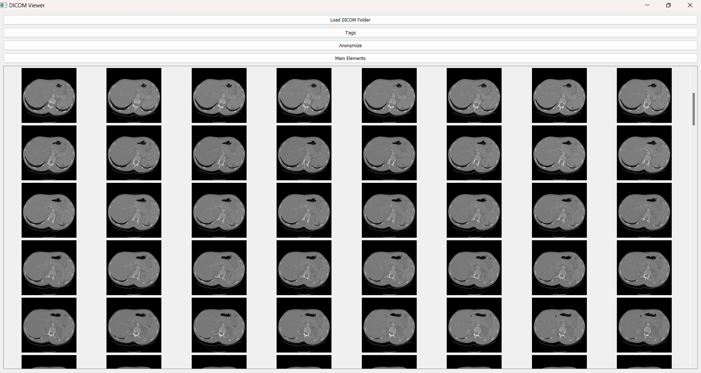
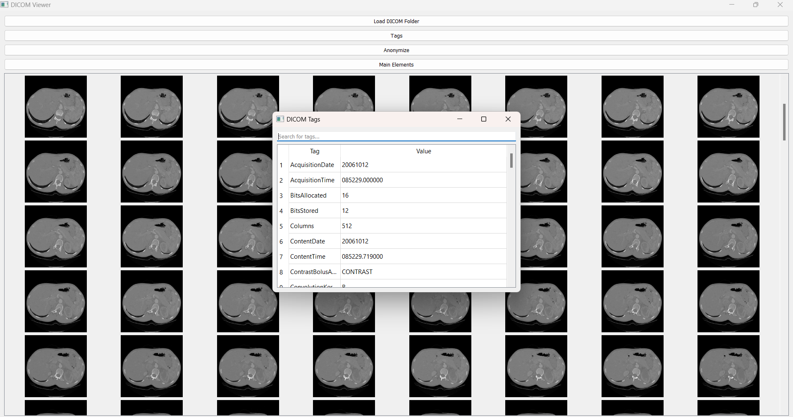

# Medical-Image-Interpretation-Interface# DICOM Viewer Application

## Overview

This DICOM Viewer application allows users to explore medical imaging data in DICOM format with advanced features, such as:
- **Multi-frame Playback**: Play multi-frame 2D DICOM (M2D) files as videos.
- **Tile View**: Display slices of 3D DICOM data as image tiles.
- **DICOM Tags Viewer**: Search and view metadata tags for DICOM files.
- **Anonymization**: Anonymize sensitive patient data by replacing it with random values.
- **Main Elements Viewer**: Display key DICOM attributes (e.g., Patient Name, Study Description).

The application was built using Python and PyQt5 for the graphical interface, along with libraries like `pydicom` and `numpy` for DICOM handling and processing.

---

## Features

1. **Load DICOM Files**  
   Load a folder containing DICOM files for visualization and processing.

2. **Multi-frame Playback**  
   Play M2D DICOM files as videos, enabling dynamic visualization of frames.

3. **Tile View**  
   View individual slices of 3D DICOM files in a scrollable, grid-based layout.

4. **DICOM Tags Viewer**  
   - Search and filter metadata tags.  
   - View tag names and their associated values.

5. **Anonymization**  
   - Replace sensitive tags (`PatientName`, `PatientID`, `StudyID`) with random values using a custom prefix.  
   - Save anonymized DICOM files to a specified folder.

6. **Main Elements Viewer**  
   Display key DICOM attributes, such as:
   - Patient Name  
   - Patient ID  
   - Study Description  
   - Modality  
   - Image Dimensions  

---

## Installation

1. Clone this repository:
   ```bash
   git clone https://github.com/yourusername/dicom-viewer.git
   cd dicom-viewer

2. Install dependencies:
   ```bash
   pip install -r requirements.txt

3. Run the application:
   ```bash
   python dicom_viewer.py

## Usage

### Load DICOM Files
1. Click **Load DICOM Folder** and select a folder containing `.dcm` files.
2. The application will automatically detect:
   - **Multi-frame 2D DICOM files** (played as videos).
   - **3D DICOM files** (displayed as tiles).

### Multi-frame Playback
For M2D files, the frames are played automatically. Use the playback area to observe changes across frames.


### Tile View
Slices of 3D DICOM files are shown in a grid. Scroll to explore all slices.



### View Tags
1. Click **Tags** to open the DICOM Tags Viewer.  
2. Use the search bar to filter tags by name.



### Anonymization
1. Click **Anonymize** and enter a custom prefix.  
2. Save the anonymized files to a chosen folder.

### View Main Elements
Click **Main Elements** to display key attributes of the loaded DICOM file.

---


## License
This project is licensed under the [MIT License](LICENSE).

---

## Acknowledgments
- **pydicom**: For working with DICOM files in Python.  
- **PyQt5**: For creating the user interface.
